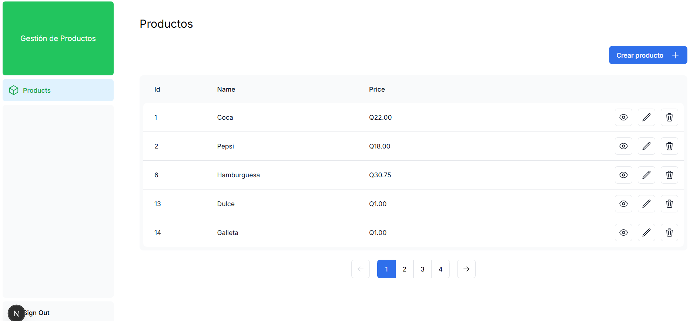

# Gestión de productos

Este proyecto esta implementado con arquitectura cliente-servidor en donde el cliente fue implemntado con **Next.js (TypeScript)**  y el servidor con **Express (TypeScript).**, en el cual se implementó una base de datos en **MySQL.**.

### Descripción

El propósito de este proyecto es la gestión de productos, cuenta con un login y un register para que el usuario pueda iniciar sesión y obtener un **JWT** que le servirá para acceder a los recursos dentro del proyecto, sino no tendrá acceso

La gestión de productos cuenta con una ventana principal que lista los productos de manera paginada, cada uno de ellos con opcion de ver detalles, editar y borrar; dicha ventana principal cuenta también con el apartado de crear producto.




## Estructura del proyecto

```text
.
├── backend
│   ├── package-lock.json
│   ├── package.json
│   ├── src
│   │   ├── Data
│   │   │   └── database.ts
│   │   ├── app.ts
│   │   ├── controllers
│   │   │   ├── auth.controller.ts
│   │   │   └── product.controller.ts
│   │   ├── middlewares
│   │   │   └── authenticateToken.ts
│   │   ├── models
│   │   │   ├── interfaces
│   │   │   │   ├── optionsPagination.interface.ts
│   │   │   │   ├── product.interface.ts
│   │   │   │   ├── productPaginated.interface.ts
│   │   │   │   └── user.interface.ts
│   │   │   └── modelsSequalize
│   │   │       ├── product.model.ts
│   │   │       └── user.model.ts
│   │   ├── routes
│   │   │   ├── auth.route.ts
│   │   │   └── product.route.ts
│   │   ├── server.ts
│   │   └── services
│   │       ├── auth.service.ts
│   │       └── password.service.ts
│   └── tsconfig.json
└── frontend
    ├── README.md
    ├── app
    │   ├── auth
    │   │   ├── layout.tsx
    │   │   ├── login
    │   │   │   └── page.tsx
    │   │   ├── page.tsx
    │   │   └── register
    │   │       └── page.tsx
    │   ├── dashboard
    │   │   ├── layout.tsx
    │   │   ├── page.tsx
    │   │   └── product
    │   │       ├── create
    │   │       │   └── page.tsx
    │   │       ├── details
    │   │       │   ├── [id]
    │   │       │   │   └── page.tsx
    │   │       │   └── page.tsx
    │   │       ├── page.tsx
    │   │       └── update
    │   │           ├── [id]
    │   │           │   └── page.tsx
    │   │           └── page.tsx
    │   ├── layout.tsx
    │   ├── lib
    │   │   ├── api.ts
    │   │   ├── definitions.ts
    │   │   ├── useValidateToken.ts
    │   │   └── utils.ts
    │   ├── page.tsx
    │   └── ui
    │       ├── acme-logo.tsx
    │       ├── button.tsx
    │       ├── dashboard
    │       │   ├── nav-links.tsx
    │       │   └── sidenav.tsx
    │       ├── fonts.ts
    │       ├── global.css
    │       ├── invoices
    │       │   ├── breadcrumbs.tsx
    │       │   ├── buttons.tsx
    │       │   ├── create-form.tsx
    │       │   ├── edit-form.tsx
    │       │   ├── pagination.tsx
    │       │   └── table.tsx
    │       ├── products
    │       │   ├── productFIllData.tsx
    │       │   └── productoFormCreate.tsx
    │       └── skeletons.tsx
    ├── next.config.ts
    ├── package.json
    ├── pnpm-lock.yaml
    ├── postcss.config.js
    ├── public
    │   ├── favicon.ico
    │   └── layoutsImg
    │       └── fondoAuth.png
    ├── tailwind.config.ts
    └── tsconfig.json

```

# Pasos para ejecutar los proyectos

## <u>Dependencias del entorno de desarrollo </u>

Para una mejor ejecución de los proyectos es recomendable contar con el siguiente versionamiento:

**node**: v22.16.0

**npm**: 11.4.2

**pnpm**: 10.15.1

**tsc**: Version 5.8.3

### <u>Backend</u>

En el Backend siempre se debe utilizar **npm**

1. Para ejecutar el Backend, después de clonar el proyecto, es necesario ejecutar en la terminal del proyecto:

```terminal 
npm install
```

Luego de realizar eso se descargarán todas las dependencias necesarias para el correcto funcionamiento del proyecto.

2. Posteriormente a esto, es necesario crear un archivo en el root del proyecto que se llame: 

```text
.env
```

Al crear este archivo en el root del proyecto, diríjase a un archivo existente llamado **.env.template**, ahí encontrará una estructura con los datos que debe colocar en su archivo **.env**, copie los datos de **.env.template** y peguelos en **.env**, posteriormente modifique esos datos del **.env** para que correspondan a los datos de su servidor.

***Nota:*** El campo **JWT_SECRET="llave secreta que se usa para crear tokens"** debe de colocar su llave secreta dentro de las comillas **""** para la generación del token seguro.

3. Finalmente ejecute la aplicación con el siguiente comando:
```terminal
npm run dev
```
Y su BackEnd debería funcionar correctamente.


### <u>Frontend </u>
En el Frontend siempre se debe utilizar **pnpm**

1. Para ejecutar el Frontend, después de clonar el proyecto, es necesario ejecutar en la terminal del proyecto:

```terminal 
pnpm install
```

Luego de realizar eso se descargarán todas las dependencias necesarias para el correcto funcionamiento del proyecto.

2. Posteriormente a esto, es necesario crear un archivo en el root del proyecto que se llame: 

```text
.env
```

Al crear este archivo en el root del proyecto, diríjase a un archivo existente llamado **.env.example**, ahí encontrará una estructura con los datos que debe colocar en su archivo **.env**, copie los datos de **.env.example** y peguelos en **.env**, posteriormente modifique esos datos del **.env** para que correspondan a los datos de su servidor Backend el cual estará consumiendo.

3. Finalmente ejecute la aplicación con el siguiente comando:
```terminal
pnpm run dev
```
Y su Frontend debería funcionar correctamente.

---

Y listo, sus proyectos deberían ejecutarse y trabajar en conjunto correctamente.